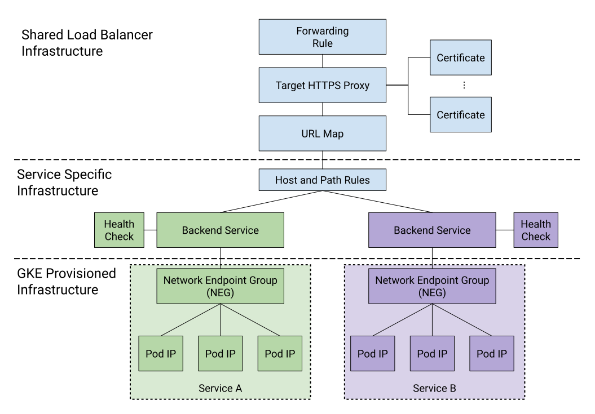

# GKE multi-namespace HTTP/S LoadBalancing

## Overview
This project demonstrates how GKE's container-native load balancing can be used to provide HTTPS ingress across namespaces.

GKE's built-in Ingress controller allows provisioning HTTP/S Load Balancers and controlling host and path rules via Ingress resources. 
However, it has the limitation of requiring at least one distinct Load Balancer per namespace. 
We can overcome this limitation by using [standalone NEGs](https://cloud.google.com/kubernetes-engine/docs/how-to/standalone-neg) and manually provisioning the Load Balancer components.

The following diagram illustrates how these components work together, and divides them into three categories:

#### Shared Load Balancer Infrastructure
These are cloud resources that only need to be provisioned once and will be shared by all services in the cluster

#### Service Specific Infrastructure 
These are cloud resources that will need to be provisioned once per service, outside of GKE

#### GKE Provisioned Infrastructure
These are resources that are provisioned by GKE as part of service creation.



A typical flow for provisioning a shared load balancer in this way would involve three stages:
1. Create the shared load balancer infrastructure. This could be done before any services are created.
1. Define at least one service, using the `cloud.google.com/neg` annotation. 
GKE will create an NEG that tracks all pods in that service.
1. Define the Service Specific Infrastructure for the service and register it with the load balancer. This involves:
    1. Creating a new Backend Service with health check
    1. Adding the services NEG to the Backend Service 
    1. Adding the Backend Service to the Load Balancer
    1. Defining a Host and Path rule that causes traffic to be routed to the new service pods

The steps below follow this process and are based heavily on https://cloud.google.com/kubernetes-engine/docs/how-to/standalone-neg

## Prerequisites
This demo assumes a zonal GKE cluster with approximately 2000 millicpus and 4GB of memory available for workloads.
It also assumes the following cli tools are installed and configured for the environment:
* [gcloud sdk cli](https://cloud.google.com/sdk/gcloud)
* [jq](https://stedolan.github.io/jq/) 
* [kubectl](https://kubernetes.io/docs/tasks/tools/install-kubectl/) 

## Limitations
* This demo uses the gcloud cli tool to manage cloud resources for demonstration purposes only. Production use cases should use Infrastructure as Code tooling.
* Using standalone NEGs removes the ability to manage L7 routing rules for the Load Balancer via Ingress resources. 
Instead, those rules need to be managed on the load balancer itself.
* Each new service added to the cluster must have it's NEG (or NEGs in regional clusters) explicitly added to a backend service. 

## Setup 

### Create Self-Signed Certificates for Testing
Here we create one self-signed certificate for alpha.example.com and one wildcard cert for *.beta.example.com.
Once created, we create certificate resources in Google Cloud so they can be used by the Load Balancer.
For further details see see https://cloud.google.com/load-balancing/docs/ssl-certificates/self-managed-certs#create-key-and-cert.
```
$ openssl genrsa -out alpha-key-file 2048

$ openssl genrsa -out beta-key-file 2048

$ openssl req -new -key alpha-key-file \
    -out alpha-csr-file \
    
You are about to be asked to enter information that will be incorporated
into your certificate request.
What you are about to enter is what is called a Distinguished Name or a DN.
There are quite a few fields but you can leave some blank
For some fields there will be a default value,
If you enter '.', the field will be left blank.
-----
Country Name (2 letter code) []:
State or Province Name (full name) []:
Locality Name (eg, city) []:
Organization Name (eg, company) []:
Organizational Unit Name (eg, section) []:
Common Name (eg, fully qualified host name) []:alpha.example.com
Email Address []:

Please enter the following 'extra' attributes
to be sent with your certificate request
A challenge password []:

$ openssl req -new -key beta-key-file \
    -out star-beta-csr-file
You are about to be asked to enter information that will be incorporated
into your certificate request.
What you are about to enter is what is called a Distinguished Name or a DN.
There are quite a few fields but you can leave some blank
For some fields there will be a default value,
If you enter '.', the field will be left blank.
-----
Country Name (2 letter code) []:
State or Province Name (full name) []:
Locality Name (eg, city) []:
Organization Name (eg, company) []:
Organizational Unit Name (eg, section) []:
Common Name (eg, fully qualified host name) []:*.beta.example.com
Email Address []:

Please enter the following 'extra' attributes
to be sent with your certificate request
A challenge password []:

$ openssl x509 -req \
    -signkey alpha-key-file \
    -in alpha-csr-file \
    -out alpha-cert \
    -days 10 

$ openssl x509 -req \
    -signkey beta-key-file \
    -in star-beta-csr-file \
    -out star-beta-cert \
    -days 10 

$ gcloud compute ssl-certificates create alpha-cert \
    --certificate=alpha-cert \
    --private-key=alpha-key-file \
    --global

$ gcloud compute ssl-certificates create star-beta-cert \
    --certificate=star-beta-cert \
    --private-key=beta-key-file \
    --global
```

### Create the HTTP Load Balancer components
First set the name and zone for your existing cluster:

```
export CLUSTER=<YOUR_CLUSTER_NAME>
export CLUSTER_ZONE=<YOUR_CLUSTER_ZONE>
```

Use that to get the network of the cluster
```$xslt
export NETWORK=$(gcloud container clusters describe cluster-2 --zone=${CLUSTER_ZONE} --format json | jq -r ".network")
export NODE=$(kubectl get nodes -oname --no-headers | head -n 1 | sed -e "s/node\///g")
export TAG=$(gcloud compute instances describe $NODE --zone ${CLUSTER_ZONE} --format json | jq -r ".tags.items[0]")
```


Then create the load balancer components 
```
// Create a firewall rule to enable healtch checking
gcloud compute firewall-rules create fw-allow-health-check-and-proxy \
  --network=${NETORK} \
  --action=allow \
  --direction=ingress \
  --target-tags=${TAG} \
  --source-ranges=130.211.0.0/22,35.191.0.0/16 \
  --rules=tcp:9376

// Create global virtual IP
gcloud compute addresses create hostname-server-vip \
  --ip-version=IPV4 \
  --global

// Create a health check
gcloud compute health-checks create http http-basic-check \
  --use-serving-port

// Create the default backend service
gcloud compute backend-services create my-bes \
  --protocol HTTP \
  --health-checks http-basic-check \
  --global


// Create the URL Map and target proxy
gcloud compute url-maps create web-map \
  --default-service my-bes

gcloud compute target-https-proxies create https-lb-proxy \
    --url-map web-map --ssl-certificates alpha-cert,star-beta-cert


// Create the forwarding rule
gcloud compute forwarding-rules create http-forwarding-rule \
  --address=hostname-server-vip \
  --global \
  --target-https-proxy=https-lb-proxy \
  --ports=443
```

### Deploy two GKE Services to Separate Namespaces

```
kubectl apply -f manifests
```
This deploys two namespaces, `alpha` and `beta`, and deploys an nginx service to each. 
Each service describes itself as either "Alpha" or "Beta" when hit on port 80

Each service is annotated to create a standalone NEG by including the `cloud.google.com/neg` annotation. Eg.
```$xslt
apiVersion: v1
kind: Service
metadata:
  name: nginx
  namespace: alpha
  annotations:
    cloud.google.com/neg: '{"exposed_ports": {"80":{}}}'
spec:
  ports:
  - port: 80
    protocol: TCP
    targetPort: 80
  selector:
    app: nginx
  type: ClusterIP
```

### Attach the the service NEGs to their respective backends with routing rules
It may take a few minutes for NEGs to be created for the services. Once created you can see them with `gcloud compute network-endpoint-grousp list`.

Create a backend service for each service:
```
// Create the beta backend service
gcloud compute backend-services create alpha-bes \
  --protocol HTTP \
  --health-checks http-basic-check \
  --global

// Create the alpha backend service
gcloud compute backend-services create beta-bes \
  --protocol HTTP \
  --health-checks http-basic-check \
  --global

```

Add the service NEGs to their respective backend services
```
export ALPHA_NEG=$(gcloud compute network-endpoint-groups list | grep alpha-nginx | awk '{ print $1 }')
export BETA_NEG=$(gcloud compute network-endpoint-groups list | grep beta-nginx | awk '{ print $1 }')

gcloud compute backend-services add-backend alpha-bes --global \
   --network-endpoint-group ${ALPHA_NEG} \
   --network-endpoint-group-zone ${CLUSTER_ZONE} \
   --balancing-mode RATE --max-rate-per-endpoint 5

gcloud compute backend-services add-backend beta-bes --global \
   --network-endpoint-group ${BETA_NEG} \
   --network-endpoint-group-zone ${CLUSTER_ZONE} \
   --balancing-mode RATE --max-rate-per-endpoint 5
```

Add routing rules to the Load Balancer for each backend service:
```
gcloud compute url-maps web-map add-path-matcher web-map \
  --path-matcher-name=alpha-path \
  --default-service=alpha-bes \
  --new-hosts=alpha.example.com \
  --path-rules="/*"=alpha-bes

gcloud compute url-maps add-path-matcher web-map\
  --path-matcher-name=star-beta-path \
  --default-service=beta-bes \
  --new-hosts="*.beta.example.com" \
  --path-rules="/*"=beta-bes  
```

Once again, it can take several minutes for the new backend services to be added and become healthy.
Backend health can be checked with `gcloud compute backend-services get-health alpha-bes --global`. 
Once each backend becomes healthy. We can begin testing.

## Testing
Since we are using hostnames to route traffic between services, we need to create DNS records.
Use `gcloud compute addresses describe hostname-server-vip --global` to get the IP of the Load Balancer.
Then add the following line to your `/etc/hosts` file (or platform equivalent):
```
// Substitute the LB IP for X.X.X.X
X.X.X.X alpha.example.com foo.beta.example.com
```

Finally, verify that each hostname is routed appropriately. We do this by calling each host 100 times, and ensuring 
we receive 100 responses from the appropriate service.

```
for x in {1..100}; do curl --cacert alpha-cert -s alpha.example.com --retry 3 | grep "Welcome to Alpha";  done | sort | uniq -c
 100    Welcome to Alpha

for x in {1..100}; do curl --cacert beta-cert -s foo.beta.example.com --retry 3 | grep "Welcome to Beta";  done | sort | uniq -c
 100    Welcome to Beta
```

## Teardown
```$xslt
kubectl delete -f manifests

gcloud compute forwarding-rules delete https-forwarding-rule --global --quiet

gcloud compute target-https-proxies delete http-lb-proxy --global --quiet

gcloud compute url-maps delete web-map --global --quiet

gcloud compute backend-services delete my-bes --global --quiet
gcloud compute backend-services delete alpha-bes --global --quiet
gcloud compute backend-services delete beta-bes --global --quiet

gcloud compute health-checks delete http http-basic-check --quiet 

gcloud compute addresses delete hostname-server-vip --global --quiet

gcloud compute firewall-rules delete fw-allow-health-check-and-proxy --quiet
```
